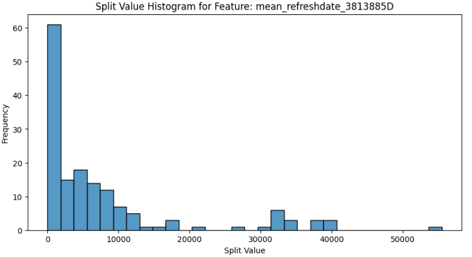
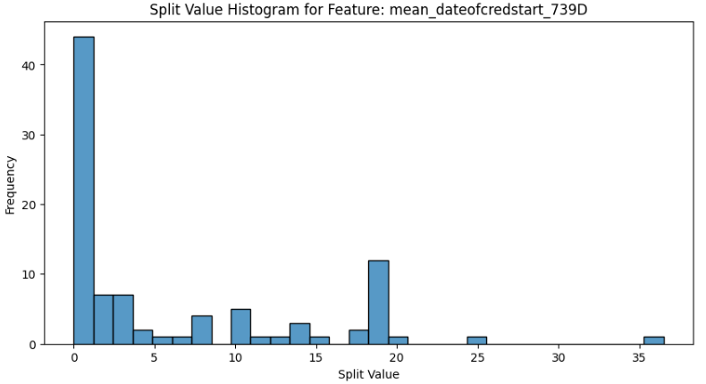
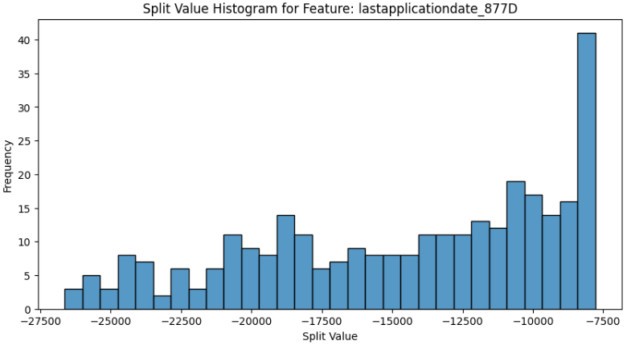
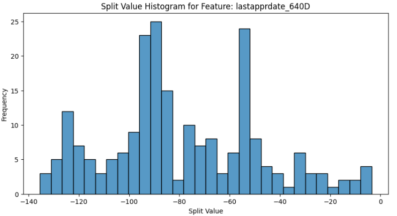

# CS116.O22_PythonforML

**Home Credit Risk**

**Credit Risk Model Stability**

**1. Giới thiệu**

Vì không có nhiều kinh nghiệm trong lĩnh vực tín dụng nói riêng và tài chính nói chung nên quá trình đọc hiểu dữ liệu và phân tích bài toán gặp khá nhiều khó khăn.

Một số đặc điểm cần được lưu ý trong cuộc thi như:

\_ Dữ liệu được cung cấp có xu hướng rất không đồng nhất, được thu thập qua các khung thời gian khác nhau, cần đảm bảo mô hình hoạt động ổn định theo thời gian.

\_ Có thể có sự chênh lệch giữa tập test được công khai và tập test của ban tổ chức, cần đảm bảo mô hình hoạt động ổn định trên cả hai tập test.

\_ Mô hình sẽ được đánh giá dựa trên metric của ban tổ chức.

**2. Số điểm đạt được trong cuộc thi**

**Version without Hack:**

Ba notebook dưới đây sẽ khác nhau một vài chi tiết

Public: 0.601 → Private: 0.528

Public: 0.601 → Private: 0.529

Public: 0.601 → Private: 0.530

**Hack version:**

Sử dụng notebook 0.58 để hack: Public: 0.605 → Private: 0.536

**3. Cải tiến các notebook có sẵn (Version Public: 0.601 → Private:
0.528)**

**Các cải tiến đã thử nghiệm:**

Tổng hợp (Aggregator) các dữ liệu dựa trên var, std, mean, median, max, min, mode, last, first, count,\...

Lọc các cột có độ tương quan dựa trên các ngưỡng khác nhau.

Loại bỏ các cột có tỉ lệ null với các ngưỡng khác nhau.

Sử dụng nhiều thư viện để lọc và loại bỏ các cột không quan trọng.

Sử dụng các encoding khác nhau cho các cột object, category (One-Hot Encoding, Label Encoding, Ordinal Encoding, Frequency Encoding, Target Encoding,\...)

Điền giá trị null với nhiều kỹ thuật khác nhau (Mean, Median, Frequency Imputation, Fillna(0), constant ví dụ -9999, 9999,..)

Xử lý các giá trị ngoại lệ (sử dụng QuantileTransformer, RobustScaler cho các cột có phân bố biến động cao, có nhiều giá trị ngoại lệ ; tính z-score cho các cột số trong tập dữ liệu và sau đó lọc các dòng có ít nhất ví dụ 60% cột số là ngoại lệ)

Sử dụng KBinsDiscretizer để biến đổi các đặc trưng liên tục thành các đặc trưng rời rạc, tạo ra các nhóm mà các giá trị liên tục ban đầu thuộc về

Sử dụng K-means áp dụng cho các cột số để tạo ra các cụm và sau đó lấy khoảng cách từ các điểm dữ liệu đến các cụm nhằm tạo thêm đặc trưng.

Sử dụng PCA áp dụng cho các cột số để tạo ra thêm đặc trưng.

Thử nghiệm các model NN, XGBoost, RGF (Regularized Greedy Forest), Random Forest

Các cách xử lý dữ liệu khác được đề cập trong các discussion như collapseData cho các cột object (thay thế các giá trị tần suất xuất hiện thấp bằng một hằng). Training sử dụng metric của cuộc thi cho các model. WeightSearch cho các model dựa trên metric của cuộc thi.

**Khó khăn gặp phải:**

Out of memory

Xử lý data bằng một file riêng sẽ làm thông tin không còn chính xáckhi lưu, LB giảm khoảng 0.002 - 0.003

Model LGBM được training bằng CPU hay GPU sau khi lưu lại, load lên sử dụng để đi dự đoán đều gây sai số và LB giảm khoảng 0.002 - 0.004

AUC của các CV có thể tăng nhưng LB không chắc tăng (các kỹ thuật đượcsử dụng ở trên đa số làm tăng AUC của model)

*→ Chọn lọc các kỹ thuật trên để áp dụng vào các notebook*

**Notebook 1: [[Home Credit (LGB + Cat
ensemble)]](https://www.kaggle.com/code/majiaqi111/home-credit-lgb-cat-ensemble)
\| Public score: 0.584**

**Cải tiến (Public score tăng lên 0.594):**

Sử dụng *fillna(-0.1)* cho các cột số thông qua thử nghiệm và dựa trên phân tích các biểu đồ, các cách phân bố giá trị của các đặc trưng số quan trọng.

Đây là 2 trong các cột có giá trị âm quan trọng đối với model lgb khi chưa fillna, có thể thấy là giá trị phân chia 0 được sử dụng nhiều nhất. Vì vậy 0 là điểm phân chia quan trọng, không nên fillna(0). Giá trị 0.1 như trong biểu đồ cũng có thể thấy nó có khả năng cũng được dùng làm giá trị phân chia nên fill(0.1) không cho hiệu quả cao. Giá trị -0.1 nằm ngoài khoảng này, và giá trị -0.1 cũng không tồn tại trong bất kì cột số nào, giúp phân biệt rõ ràng các giá trị thiếu với các giá trị hợp lệ, ngoài ra có thử với -999, -9999 để chọn ra hằng số tốt.

Cũng có một vài các cột sử dụng giá trị âm để phân chia nhưng đa số đều cách xa giá trị 0, vì vậy fillna -999, -9999 cũng có thể gây sai trong việc training:

Một phần rất nhỏ rơi vào các trường hợp hiếm còn lại (chiếm khoảng 1% trong số các cột số)*,* việc *fillna(-0.1)* có thể gây ra khả năng sai số nhưng là không đáng kể. Đối với cột không có giá trị âm, -0.1 là một giá trị hợp lý để phân biệt rõ ràng các giá trị thiếu với các giá trị hợp lệ.

Tìm các đặc trưng quan trọng sau khi training LGBM và Catboost, tiến hành tạo thêm các đặc trưng mới dựa trên các đặc trưng này (74 đặc trưng mới) dựa trên ý nghĩa tên các cột, dưới đây là một vài cột minh họa:

  -   **Đặc trưng logic:**

      df_train\[\'is_high_debt\'\] = (df_train\[\'totaldebt_9A\'\] \> df_train\[\'mean_totaloutstanddebtvalue_39A\'\]).astype(int)

      df_train\[\'is_recently_approved\'\] = (df_train\[\'max_approvaldate_319D\'\] \> df_train\[\'mean_approvaldate_319D\'\]).astype(int)

  -   **Đặc trưng tỉ lệ:**

      df_train\[\'mean_credamount_per_totaldebt\'\] = df_train\[\'mean_credamount_590A\'\] / (df_train\[\'totaldebt_9A\'\] + 1e-9)

      df_train\[\'mean_overdueamountmax2_per_max_overdueamountmax2date\'\] = df_train\[\'mean_overdueamountmax2_14A\'\] / (df_train\[\'max_overdueamountmax2date_1142D\'\] + 1e-9)

  -   **Đặc trưng tổng hợp:**

      df_train\[\'total_debt_and_max_debtoutstand\'\] = df_train\[\'totaldebt_9A\'\] + df_train\[\'max_debtoutstand_525A\'\]

      df_train\[\'mean_and_max_credamount\'\] = df_train\[\'mean_credamount_590A\'\] + df_train\[\'max_credamount_590A\'\]

  -   **Đặc trưng log:**

      df_train\[\'log_mean_credamount\'\] = np.log1p(df_train\[\'mean_credamount_590A\'\])

      df_train\[\'log_totaldebt\'\] = np.log1p(df_train\[\'totaldebt_9A\'\])

  -   **Đặc trưng tổng hợp các cột số dựa trên các cột object**

      df_train\[\'mean_credamount_by_incometype\'\] = df_train.groupby(\'max_incometype_1044T\')\[\'mean_credamount_590A\'\].transform(\'mean\')

      df_train\[\'totaldebt_by_familystate\'\] = df_train.groupby(\'max_familystate_726L\')\[\'totaldebt_9A\'\].transform(\'sum\')

PCA cho các cột số, giúp loại bỏ các đặc trưng dư thừa và giảm thiểu nhiễu trong dữ liệu, sử dụng các đặc trưng này làm các đặc trưng mới (8% - 10% tổng số lượng đặc trưng).

Thay đổi và sử dụng 2 bộ tham số cho LGBM để mỗi mô hình có thể học từ các phần khác nhau của dữ liệu, giúp đạt được một mô hình tổng hợp mạnh mẽ hơn.

**Notebook 2: [[Credit Risk Prediction with LightGBM and
CatBoost]](https://www.kaggle.com/code/pereradulina/credit-risk-prediction-with-lightgbm-and-catboost) | Public score: 0.59**

**Cải tiến (Public score tăng lên 0.597-0.598):**

*fillna(-0.1)* cho các cột số thông qua thử nghiệm và dựa trên phân tích các biểu đồ, các cách phân bố giá trị của các đặc trưng số quan trọng.

PCA cho các cột số, giúp loại bỏ các đặc trưng dư thừa và giảm thiểu nhiễu trong dữ liệu, sử dụng các đặc trưng này làm các đặc trưng mới (8% - 10% tổng số lượng đặc trưng).

Sử dụng optuna với metric của cuộc thi, đánh giá model với chỉ 62 tuần đầu để chọn lại bộ tham số cho LGBM và CatBoost (sử dụng bộ tham số làm giảm độ phức tạp của mô hình nhưng vẫn giữ nguyên hoặc cải thiện được điểm số).

Nếu tạo thêm các đặc trưng logic, tỉ lệ,.. như notebook 1 thì Publicscore tăng lên \>= 0.599 nhưng gặp trở ngại out of memory

**4. Ensemble**

**Sử dụng 2 notebook trên để dự đoán và lấy trung bình**

*Public: 0.600 - 0.601 → Private: 0.529*

**Notebook 1 sử dụng WeightSearch cho 62 tuần đầu, Notebook 2 giữ nguyên**

*Public: 0.600 - 0.601 → Private: 0.530*

**Notebook 1 chỉ sử dụng LGBM và giữ nguyên Notebook 2**

*Public ổn định cao với 0.601 → Private: 0.528*

**5. Kết luận**

Xử lý, lựa chọn các đặc trưng và kết hợp các model để tạo ra sự ổn định trong việc dự đoán là các bước quan trọng nhất trong cuộc thi này

